# The Slop Feedback Loop: How We Used AI to Filter AI Bugs

**Deliverable first:** `pip install a3-python` gives you a package that automatically discovers bug candidates, filters out as many as possible with static analysis, and then asks an LLM to make the final call only on a much smaller uncertain set.

That is the ending. Now for the weird beginning.

## One ridiculous origin story

This did not start as "let's make a Python CLI."

It started with an almost unserious challenge: can an AI generate a genuinely new verification theory at research-paper scale, then survive contact with implementation?

The original framing was delightfully specific: ask for Voevodsky-level mathematical ambition aimed at something a Z3 builder like Nikolaj Bjørner would still find operationally useful.

The earliest phase produced a long, ambitious manuscript on quantitative model checking. The central move was elegant:

- stop asking only "is the system safe?"
- start asking "how far is it from safety?"
- use that distance as a semantic object you can optimize.

In other words, make verification feel less like a courtroom verdict and more like geometry.

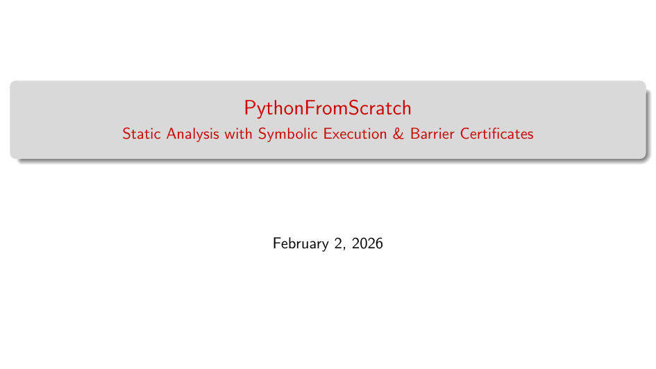

The paper-level ideas were ambitious enough to be interesting and dangerous enough to be wrong in many ways once code entered the room. That tension is the whole story.

## Episode I: the "distance to safety" era

The first era was all about metric semantics:

- traces as distributions,
- properties as structured acceptance sets,
- distance to satisfaction as a first-class quantity.

This gave three useful instincts that survived to production:

1. Safety is not just a Boolean; uncertainty has shape.
2. Quantitative semantics can prioritize work.
3. If distance can be computed, repair can be guided.

What did not survive unchanged was the fantasy that this alone solves industrial bug detection. In real codebases, most pain is not proving one deep theorem; it is killing mountains of false positives without missing true bugs.

In hindsight, the arc is clear: a 74-page quantitative semantics manuscript came first, then a dense algebraic synthesis treatment of safety witnesses, and finally a Python-exact semantics draft that made those witness ideas executable in tooling.

## Episode II: the "prove unreachable" era

The second era shifted from measurement to separation.

Instead of asking only "how close is unsafe behavior?", the system asked:

- what set is reachable,
- what set is unsafe,
- and can we synthesize a witness that keeps those sets disjoint?

That witness is the barrier-certificate idea.

You can read it as: construct a mathematical fence `B(x)` so that

- initial states are on the safe side,
- unsafe states are on the forbidden side,
- and transitions never cross the fence.

That sounds abstract until it gets wired into a concrete analysis stack.

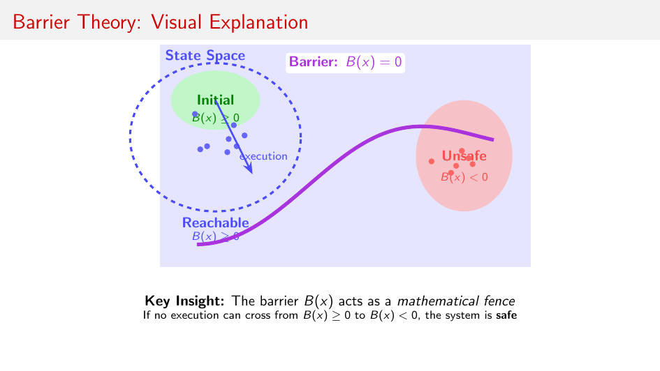

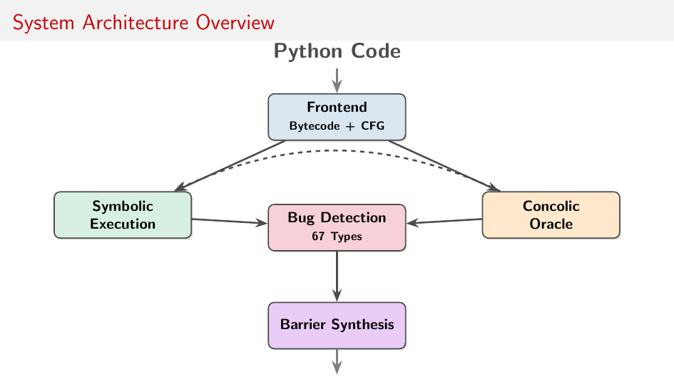

Once attached to symbolic execution, SMT feasibility checks, and refinement loops, barrier reasoning stops being decorative math and becomes a high-throughput false-positive filter.

## Episode III: the Python reality era

The third era was the hardest: making the theory survive Python exactly enough to matter.

That meant committing to execution details instead of hand-wavy semantics:

- bytecode-level control flow,
- normal and exceptional edges,
- frame/stack state,
- dynamic dispatch,
- unknown library behavior,
- and explicit unsafe predicates for real bug classes.

This is where lots of elegant claims died. Good. They needed to.

The theory was then rewritten to reflect executable reality: safety as reachability exclusion over an explicit transition system, with contracts for unknown calls and concolic checks as refinement evidence.

## The actual engine: AI theorizing -> coding -> testing -> fixing code -> fixing theory

This loop was repeated enough times that it became the project's real method.

### 1) AI theorizing

AI was used to generate broad hypotheses fast:

- new abstractions,
- candidate proof templates,
- odd cross-domain analogies,
- aggressive architectural combinations.

Most of these were not immediately trustworthy.

### 2) Coding

Ideas were encoded in analyzers:

- bytecode/CFG extraction,
- symbolic state propagation,
- unsafe-region checks,
- barrier template synthesis,
- dynamic symbolic/concolic validation.

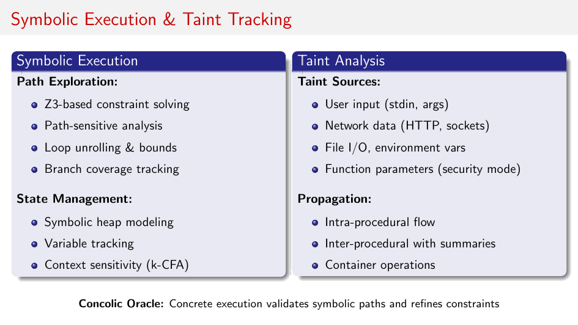

### 3) Testing

Then came the expensive truth step:

- synthetic suites,
- regression tests,
- large-repo scans,
- confidence calibration,
- triage audits.

### 4) Fixing code

Typical breakages were familiar:

- path explosion,
- over-conservative unknown-call handling,
- context-loss across call boundaries,
- duplicate floods,
- false positives on guard-heavy code.

### 5) Fixing theory

This was the underappreciated step. Instead of forcing code to match a brittle theory, the theory itself was patched:

- definitions tightened,
- assumptions made explicit,
- proof obligations split by semantics layer,
- unknown behavior modeled as contracts with conservative fallback.

Then the loop restarted.

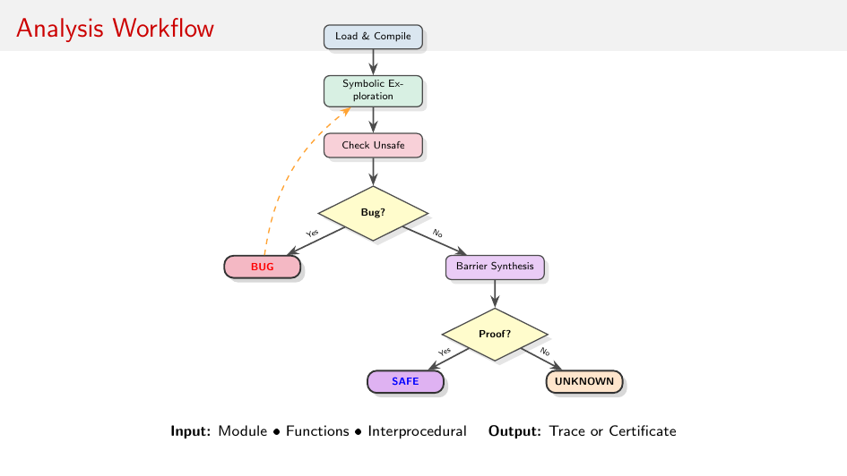

This is "fighting AI slop with AI slop" in practice: generate aggressively, then subject everything to adversarial execution.

## A short technical example: why the loop mattered

Consider the bug claim "failing assertion escapes uncaught."

At theory level, this is a reachability question into an unsafe region.

At code level, it depends on details:

- is the failing assert reachable,
- are asserts enabled,
- does an enclosing handler catch it,
- does a caller catch it,
- does a `finally` path alter propagation?

A naive detector over-reports. A purely theorem-level account under-specifies runtime behavior. The loop forced both sides to meet in the middle: precise-enough execution semantics plus conservative proof rules.

The same pattern repeated for unknown library calls:

- fully deterministic assumptions were unsound,
- fully nondeterministic assumptions were noisy,
- contract-overapproximation + concolic witness checks gave a workable middle.

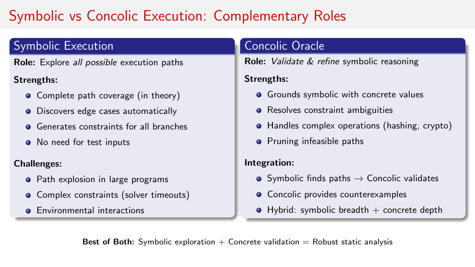
   
## Back-in-time detective board: where did these ideas come from?

Trying to reverse-engineer the lineage is half the fun. The final system seems to inherit from at least five worlds:

1. **Quantitative semantics** from the early distance-based theory.
2. **Control-theoretic safety witnesses** from Lyapunov/barrier thinking.
3. **Model-checking refinement** from CEGAR-style loops.
4. **Compiler/runtime realism** from bytecode and exception semantics.
5. **Agentic tool use** from modern LLM coding workflows.

No single field would naturally propose this exact combination on day one.

AI, however, is very good at proposing weird crossovers quickly. The quality filter is not the novelty of the crossover. The quality filter is whether it survives tests.

## What shipped: a static-first, agentic-second package

By the time this became a pip package, the architecture had hardened into a simple principle:

- put deterministic, auditable, non-LLM reasoning first,
- reserve LLM judgment for the residual uncertainty.

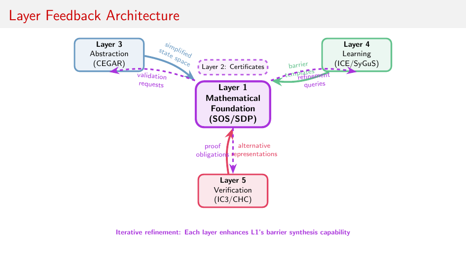

### Static-first stage

The static stage does the heavy lifting:

- discover candidate issues across many bug types,
- run symbolic checks and path-sensitive reasoning,
- apply barrier/invariant-style elimination,
- deduplicate and score,
- preserve evidence in SARIF.

This is where most noise disappears.

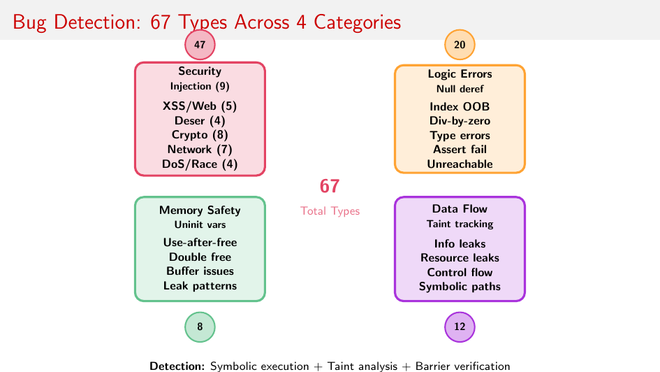

### The kitchensink approach: steal the best ideas, orchestrate them, don't worship any single paper

The static-first stage is not one technique. It's a paper portfolio.

In this repo that portfolio is called `kitchensink`, and it is enabled by default in scanning mode (you can disable it with `--no-kitchensink` when you explicitly want a narrower run).

The practical rule is simple:

1. Classify the bug shape.
2. Route to the strongest low-cost method first.
3. Escalate only when proof/counterexample remains unresolved.
4. Keep competing methods as cross-checks, not decorations.

Concretely, that means combining and sequencing results from:

- Barrier-certificate foundations for safety separation [1][2].
- Algebraic proof machinery (Positivstellensatz, SOS/SDP, hierarchy lifting, sparsity, and DSOS/SDSOS speed layers) [3][4][5][6][7][18].
- Property-directed and CHC-style reachability engines [8][9][10].
- Abstraction-refinement families (classic CEGAR, SAT predicate abstraction, lazy interpolation-based abstraction) [11][12][13].
- Learning/synthesis families (ICE, Houdini, SyGuS) that propose and refine invariants [14][15][16].
- Compositional assume-guarantee reasoning for interprocedural scaling [17].

That is the kitchensink point: treat great papers as interoperable components in a verification control loop, not as mutually exclusive camps.

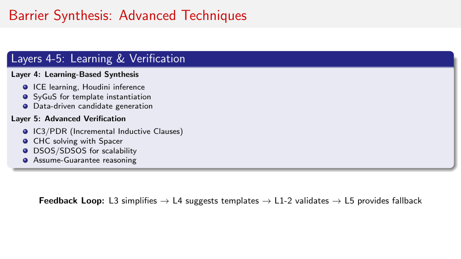

### Agentic-second stage

Only the leftovers are sent to an LLM agent with tools to inspect real context:

- read concrete source ranges,
- search for guards and preconditions,
- inspect callers and tests,
- follow imports,
- then produce a TP/FP classification with rationale.

The key is not "LLM decides everything." The key is "LLM decides only where static proof and disproof both stop."

## CI as a ratchet, not a firehose

A practical design choice made this deployable in messy repos: baseline ratcheting.

- Existing accepted findings are recorded.
- New unaccepted findings fail CI.
- Disappearing findings are auto-pruned.

That shifts the team experience from "infinite backlog" to "no net new risk," which is the only sustainable adoption model for large existing codebases.

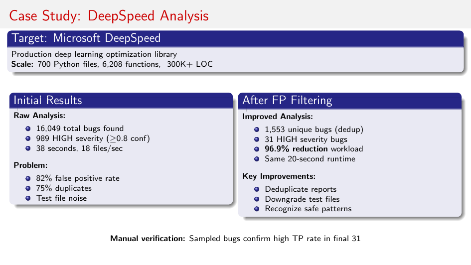

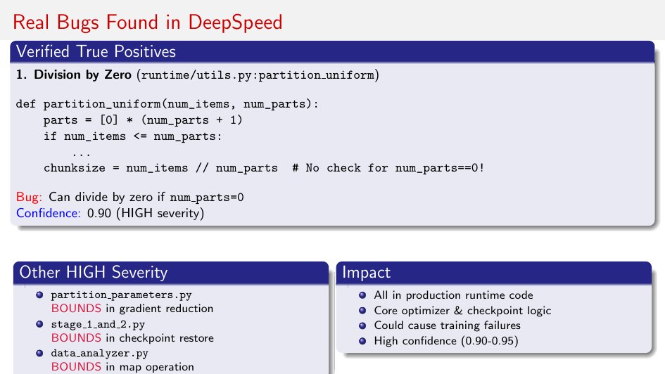

## Why this architecture specifically fights slop

It fights slop at three levels:

1. **Theoretical slop**
   AI-generated theory is forced through explicit semantics and proof obligations.

2. **Implementation slop**
   Analyzer claims are checked against tests, concrete runs, and refinement loops.

3. **Operational slop**
   Alert floods are collapsed by static filters before LLM triage and human review.

So yes, this is "AI slop vs AI slop," but not symmetrically.

- Upstream AI expands hypothesis space.
- Midstream formal/static machinery prunes it brutally.
- Downstream agentic AI handles the hard residue.

That asymmetry is what makes it useful.

## The practical takeaway

If you want this pattern outside this repo, keep the order:

1. Generate broadly.
2. Filter with sound-ish machinery first.
3. Escalate only uncertain cases to adaptive intelligence.
4. Keep a CI ratchet so quality only moves one way.

Do those four things and "AI-assisted" starts to look less like hype and more like engineering.

## References (kitchensink stack)

1. S. Prajna, A. Jadbabaie, G. J. Pappas. "Safety verification of hybrid systems using barrier certificates." HSCC, 2004.
2. S. Prajna, A. Jadbabaie, G. J. Pappas. "A framework for worst-case and stochastic safety verification using barrier certificates." IEEE Transactions on Automatic Control, 2007.
3. M. Putinar. "Positive polynomials on compact semi-algebraic sets." Indiana University Mathematics Journal, 1993.
4. P. A. Parrilo. "Semidefinite programming relaxations for semialgebraic problems." Mathematical Programming, Series B, 2003.
5. J.-B. Lasserre. "Global optimization with polynomials and the problem of moments." SIAM Journal on Optimization, 2001.
6. M. Kojima, S. Kim, H. Waki. "Sparsity in sums of squares of polynomials." Mathematical Programming, Series B, 2005.
7. A. A. Ahmadi, A. Majumdar. "DSOS and SDSOS optimization: more tractable alternatives to sum of squares and semidefinite optimization." SIAM Journal on Applied Algebra and Geometry, 2019.
8. A. R. Bradley. "SAT-Based Model Checking without Unrolling." VMCAI, 2011.
9. A. Komuravelli, A. Gurfinkel, S. Chaki. "SMT-based model checking for recursive programs." CAV, 2014.
10. K. L. McMillan. "Interpolation and SAT-Based Model Checking." CAV, 2003.
11. E. Clarke, O. Grumberg, S. Jha, Y. Lu, H. Veith. "Counterexample-Guided Abstraction Refinement." CAV, 2000.
12. E. Clarke, D. Kroening, N. Sharygina, K. Yorav. "Predicate Abstraction of ANSI-C Programs Using SAT." Formal Methods in System Design, 2004.
13. K. L. McMillan. "Lazy Abstraction with Interpolants." CAV, 2006.
14. P. Garg, C. Loeding, P. Madhusudan, D. Neider. "ICE: A Robust Framework for Learning Invariants." CAV, 2014.
15. C. Flanagan, K. R. M. Leino. "Houdini, an Annotation Assistant for ESC/Java." FME, 2001.
16. R. Alur, R. Bodik, G. Juniwal, M. M. K. Martin, M. Raghothaman, S. A. Seshia, R. Singh, A. Solar-Lezama, E. Torlak, A. Udupa. "Syntax-Guided Synthesis." FMCAD, 2013.
17. T. A. Henzinger, S. Qadeer, S. K. Rajamani. "You Assume, We Guarantee: Methodology and Case Studies." CAV, 1998.
18. S. Prajna, A. Papachristodoulou, P. A. Parrilo. "SOSTOOLS: Sum of squares optimization toolbox for MATLAB." 2002.

**Deliverable last:** `a3-python` is the shipped pip package that does exactly this: automatic bug discovery, aggressive static false-positive filtering, and LLM final judgment on the much smaller uncertain set.
